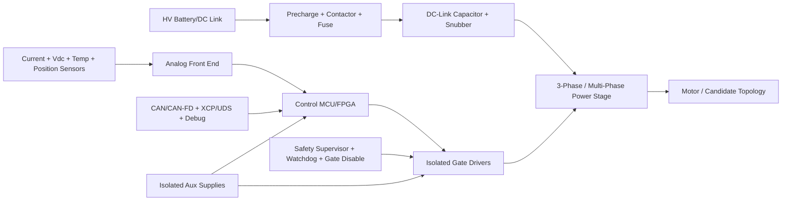

# 可控磁通量方案 BOM 配件清单与 EDA 电路集成设计

## 0. 设计边界

本文启动每种方案的 BOM 和 EDA 集成设计，但不锁定具体厂商料号。原因是高压等级、峰值相电流、冷却方式、ASIL 目标、封装尺寸、成本边界还未冻结。当前阶段输出架构级 BOM、EDA 模块、接口、保护和 PCB/安规约束，用于指导后续 KiCad/Altium 原理图分层。

所有方案默认遵守：

- 高压功率回路和低压控制回路隔离设计；
- 预充、主接触器、硬件 gate-disable 优先于软件控制；
- 电流、Vdc、温度、位置传感链路必须有诊断；
- 协议层至少包含 CAN/CAN-FD 运行通信和 XCP/UDS 标定诊断；
- 高压实机前必须完成温度、退磁、过流、过压、欠压和传感器故障保护。

## 1. EDA 电路集成设计总架构

## 2. 通用 BOM 配件清单

| 模块 | BOM 配件类别 | 备注 |
|---|---|---|
| 高压输入 | 保险、预充电阻、预充继电器/接触器、主接触器、母线电压采样 | 电压等级和爬电距离待冻结 |
| DC Link | 薄膜电容/电解电容、阻尼/吸收、放电电阻、母排 | 需要按纹波电流和脉冲工况校核 |
| 功率桥 | SiC/GaN/IGBT/MOSFET 模块、相电流采样、相电压采样 | V1 不锁定器件技术路线 |
| 栅极驱动 | 隔离驱动、DESAT/短路保护、米勒钳位、负压关断、隔离电源 | 必须支持硬件关断 |
| 控制板 | MCU/FPGA、时钟、复位、看门狗、NVM、调试接口 | 需要满足 LUT 和采样带宽 |
| 传感器 | 相电流、母线电压、温度、编码器/旋变、绝缘监测 | 所有关键传感器需诊断 |
| 通信 | CAN/CAN-FD、隔离收发器、XCP/UDS 调试链路、USB/UART 工程口 | 生产和工程接口应分层 |
| 热与安全 | 温度采集、故障锁存、硬件 gate-disable、DTC 记录 | 安全链路不只依赖主循环软件 |

## 3. 分层 EDA 原理图页建议

| 原理图页 | 内容 |
|---|---|
| `00_System_Block` | 系统框图、连接器、供电树 |
| `01_HV_Input_Precharge` | 高压输入、预充、接触器、母线采样 |
| `02_DC_Link_Power_Stage` | DC Link、三相/多相桥、吸收回路 |
| `03_Gate_Drivers` | 隔离驱动、故障反馈、硬件关断 |
| `04_Current_Voltage_Sense` | 相电流、母线电压、相电压采样 |
| `05_Position_Temperature` | 编码器/旋变、温度、绝缘/漏电检测 |
| `06_MCU_Control` | MCU、ADC、PWM、NVM、时钟、复位 |
| `07_Safety_Watchdog` | 看门狗、故障锁存、gate-disable、安全电源监测 |
| `08_Comms_Debug` | CAN/CAN-FD、XCP/UDS、USB/UART、调试口 |
| `09_Route_Extensions` | 混合励磁、绕组重构、多相、磁化脉冲等扩展 |

## 4. 每种方案 BOM/EDA 落地

### negative_d_axis_field_weakening

**BOM 配件清单**

- 标准三相牵引逆变器功率级。
- MCU 控制板，需支持同步 ADC 采样和 FOC。
- 相电流传感器、母线电压传感器、编码器/旋变接口。
- 隔离栅极驱动、隔离电源、温度采样。

**EDA 电路集成设计**

- 原理图重点在 `02_DC_Link_Power_Stage`、`03_Gate_Drivers`、`04_Current_Voltage_Sense`、`06_MCU_Control`。
- 负 d 轴弱磁不新增功率硬件，但必须把 `id_min(T)` 保护放进安全链路。

**连接器与协议**

- CAN/CAN-FD：转矩请求、使能、故障状态。
- XCP：`id_min(T)`、FW 限幅、Vdc 降额标定。
- 位置接口：旋变或编码器。

**PCB/安规集成注意事项**

- 相电流采样走线和功率开关节点隔离。
- Vdc 分压链满足高压爬电和故障耐压。
- gate-disable 硬件路径优先级高于软件 FOC。

### mtpa_fw_mtpv_control

**BOM 配件清单**

- 三相逆变器和控制板。
- 足够容量的 MCU Flash/NVM 或外部存储，用于 MTPA/FW/MTPV LUT。
- 高精度电流/Vdc/位置传感链路。
- CAN/CAN-FD 和 XCP 标定链路。

**EDA 电路集成设计**

- 在 `06_MCU_Control` 页预留 LUT 存储、CRC 校验和调试访问。
- ADC 触发必须与 PWM 同步，避免高速区轨迹误判。

**连接器与协议**

- CAN：转矩命令、模式状态、降额状态。
- XCP/UDS：LUT 下载、CRC 校验、边界命中计数。

**PCB/安规集成注意事项**

- 编码器/旋变线远离半桥开关节点。
- 外部存储若使用 QSPI，注意阻抗、长度和 EMC。

### svpwm_overmodulation_voltage_utilization

**BOM 配件清单**

- 支持高速开关和故障反馈的栅极驱动。
- 低 ESL DC-Link 电容、吸收/snubber。
- 更高带宽的相电流采样链路。
- EMI 滤波、共模抑制和屏蔽连接件。

**EDA 电路集成设计**

- `03_Gate_Drivers` 页需要明确死区、DESAT、米勒钳位和故障反馈。
- `02_DC_Link_Power_Stage` 页需要标注换流环路和吸收器件位置。

**连接器与协议**

- CAN：调制模式允许/禁止、V 裕度、故障。
- XCP：`k_mod`、过调制阈值、模式切换转速。

**PCB/安规集成注意事项**

- 缩小半桥换流环路。
- 电流采样抗混叠频率要覆盖过调制谐波评估。
- EMI 设计需要和机壳接地、屏蔽层一起评审。

### nonlinear_flux_lut

**BOM 配件清单**

- MCU 或外部 Flash/NVM。
- 温度传感器输入。
- 高精度电流和 Vdc 采样。
- 标定/诊断通信接口。

**EDA 电路集成设计**

- `06_MCU_Control` 页加入 LUT 存储和版本/CRC 机制。
- `05_Position_Temperature` 页确保温度采样可用于 LUT 选择。

**连接器与协议**

- XCP/UDS：LUT 下载、版本管理、边界命中诊断。
- CAN：运行时 LUT 版本、降额状态。

**PCB/安规集成注意事项**

- 外部存储需保证启动加载可靠。
- LUT 越界必须触发降额或 fallback，不允许静默外推。

### magnetic_saturation_codesign

**BOM 配件清单**

- 候选电机样机端子和温度采集线束。
- 牵引逆变器复用。
- 台架高速采集设备。
- 候选版本识别 EEPROM 或 ID 电阻。

**EDA 电路集成设计**

- 在 `09_Route_Extensions` 加候选样机识别和传感器扩展。
- 控制板支持候选参数包切换和日志回灌。

**连接器与协议**

- CAN/XCP：候选 ID、LUT 版本、温度、电压/电流裕度。
- FEA 数据导入链路：FEA CSV/JSON -> 校准包 -> MCU。

**PCB/安规集成注意事项**

- 样机线束要保留温度和振动测试通道。
- 候选切换不允许绕过安全限值。

### pmasynrm_high_saliency_low_pm

**BOM 配件清单**

- PMaSynRM 样机。
- 角度精度更高的位置传感器。
- 低噪声相电流采样。
- NVH/转矩脉动测试接口。

**EDA 电路集成设计**

- `05_Position_Temperature` 强化位置反馈抗干扰。
- `06_MCU_Control` 需要 saliency-aware MTPA/MTPV 标定空间。

**连接器与协议**

- CAN：转矩、转速、可用转矩。
- XCP：磁阻转矩占比、ripple 指标、模式参数。

**PCB/安规集成注意事项**

- 角度误差会直接影响磁阻转矩利用，位置接口必须低抖动。
- 电流采样偏置会放大 MTPA 误差。

### variable_magnetization_memory_motor

**BOM 配件清单**

- 支持磁化脉冲的逆变器和 DC-Link。
- 脉冲电流量程覆盖的电流传感器。
- 磁链状态观测传感链路。
- 磁钢温度采样。
- 硬件脉冲许可/禁止链路。

**EDA 电路集成设计**

- `09_Route_Extensions` 新增磁化脉冲管理。
- 脉冲命令必须有硬件 interlock，不能仅靠软件变量。
- 事件波形必须可被高速日志捕获。

**连接器与协议**

- VCU->MCU：是否允许磁化脉冲。
- MCU->VCU：磁链状态、置信度、脉冲能量、未知状态降额。
- XCP：脉冲窗口、能量限制、状态估计参数。

**PCB/安规集成注意事项**

- DC-Link 和采样链路需按脉冲峰值校核。
- 未知磁链状态默认保守降额。
- 磁化脉冲禁止在传感器不可信或高温下执行。

### hybrid_excitation

**BOM 配件清单**

- 主牵引逆变器。
- 励磁 DC/DC 或 chopper。
- 励磁绕组电流传感器。
- 励磁绕组连接器。
- 励磁温度传感器。
- 励磁侧隔离电源和保护器件。

**EDA 电路集成设计**

- `09_Route_Extensions` 增加励磁功率级。
- 主逆变器和励磁变换器需要共享 MCU 状态机，但故障保护独立。

**连接器与协议**

- CAN：转矩请求、励磁可用状态、失励故障。
- XCP：`if`、励磁限流、励磁热模型。

**PCB/安规集成注意事项**

- 励磁功率级热源和主控模拟采样分区。
- 励磁绕组开路/短路必须可检测。
- 励磁电流不能与主相电流测量混用。

### winding_reconfiguration

**BOM 配件清单**

- 高电流绕组切换矩阵。
- 切换器件驱动和隔离。
- 配置反馈检测。
- 绝缘/连续性检测。
- 故障额定连接器和母排。

**EDA 电路集成设计**

- `09_Route_Extensions` 增加切换矩阵和硬件互锁。
- 非法绕组组合必须由硬件禁止。
- 切换命令必须经过速度/电流/转矩连续性检查。

**连接器与协议**

- MCU->Switch：配置命令。
- Switch->MCU：配置反馈、故障、温度。
- CAN：当前配置、切换允许、故障码。

**PCB/安规集成注意事项**

- 大电流切换路径更像功率母排/功率模块，不宜放在普通控制 PCB 上。
- 切换矩阵需要单独爬电、清洁和热设计。
- 默认安全配置必须硬件可验证。

### multiphase_phase_group_control

**BOM 配件清单**

- 多相或双相组逆变器功率级。
- 多通道电流传感器。
- 更多 PWM/ADC 资源的 MCU 或 FPGA。
- 多相连接器。
- 每相组独立温度采样和 gate-driver fault。

**EDA 电路集成设计**

- `02_DC_Link_Power_Stage` 拆成 Phase Group A/B。
- `03_Gate_Drivers` 按相组独立故障域设计。
- `06_MCU_Control` 先做 PWM/ADC 资源预算。

**连接器与协议**

- CAN：可用转矩、缺相状态、降额。
- XCP：每相组电流、热状态、fault injection。

**PCB/安规集成注意事项**

- 相组电流传感器方向和量程必须一致。
- 多相走线增加 EMC 风险，布局前先做接口预算。

### thermal_demag_safety_protection

**BOM 配件清单**

- 绕组温度、磁钢/转子温度估计输入。
- 母线电压和相电流采样。
- 硬件看门狗。
- 故障锁存器。
- gate-disable 硬线。
- 故障日志存储。

**EDA 电路集成设计**

- `07_Safety_Watchdog` 是强制页面。
- gate-disable 必须能绕过应用层 FOC 直接关断驱动。
- DTC 和故障快照要能复位后追溯。

**连接器与协议**

- CAN/UDS：DTC、降额原因、传感器状态。
- XCP：温度估计、id_min(T)、Imax(T)。

**PCB/安规集成注意事项**

- 安全采样和普通标定采样分清优先级。
- 温度线束需要 ESD、滤波和开短路诊断。

### weighted_efficiency_pareto_selection

**BOM 配件清单**

- 数据记录存储或外部记录仪。
- CAN/CAN-FD 通信。
- XCP/USB/UART 工程接口。
- 标定版本存储。
- 关键测点 test points。

**EDA 电路集成设计**

- `08_Comms_Debug` 明确量产通信和工程调试边界。
- `06_MCU_Control` 保存 route ID、scorecard version 和 calibration CRC。

**连接器与协议**

- CAN：运行状态、选中方案、可用转矩、降额。
- XCP：效率地图数据、试验点记录。
- USB/UART：工程调试，不作为量产依赖。

**PCB/安规集成注意事项**

- 工程调试口要有 ESD 和访问控制。
- 数据记录不应影响实时控制任务。

## 5. 下一步 EDA 动作

1. 冻结 DC bus、电流等级、冷却方式和封装目标。
2. 建立 `eda/` 目录，按原理图页拆分 KiCad/Altium 工程。
3. 先画通用三相逆变器、控制板、采样、安全链路。
4. 再把混合励磁、绕组重构、多相、磁化脉冲作为 `09_Route_Extensions` 可插拔扩展页。
5. 每次进入具体方案硬件前，先更新 `models/scheme_bom_eda_catalog.json` 中的 BOM 状态和阶段门。
