# 可控磁通量方案驱动设计、上电时序和协议图册

本文为每个方案给出三类图：驱动设计图、上电时序图、协议链路图。图使用 Mermaid，可在支持 Mermaid 的 Markdown 工具中直接渲染，后续可导出 SVG/PNG。

## 1. negative_d_axis_field_weakening

### 驱动设计图

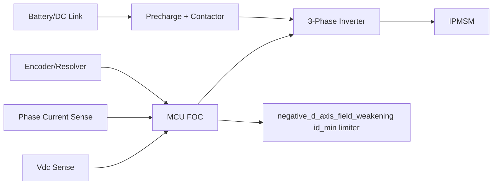
```mermaid
flowchart LR
  B[Battery/DC Link] --> P[Precharge + Contactor]
  P --> INV[3-Phase Inverter]
  INV --> M[IPMSM]
  MCU[MCU FOC] --> INV
  ENC[Encoder/Resolver] --> MCU
  CUR[Phase Current Sense] --> MCU
  VDC[Vdc Sense] --> MCU
  MCU --> FW[negative_d_axis_field_weakening id_min limiter]
```

### 上电时序图

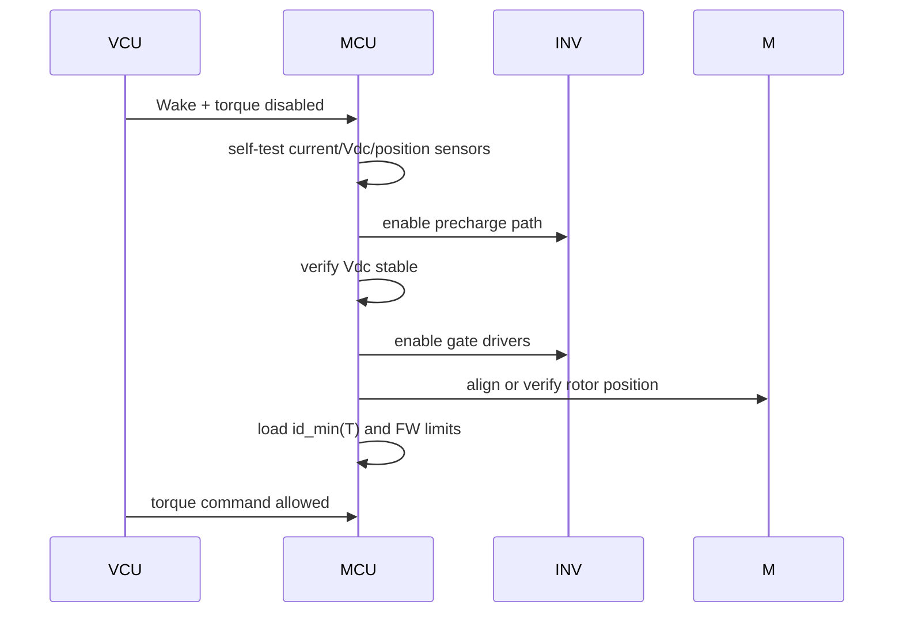
```mermaid
sequenceDiagram
  participant VCU
  participant MCU
  participant INV
  participant M
  VCU->>MCU: Wake + torque disabled
  MCU->>MCU: self-test current/Vdc/position sensors
  MCU->>INV: enable precharge path
  MCU->>MCU: verify Vdc stable
  MCU->>INV: enable gate drivers
  MCU->>M: align or verify rotor position
  MCU->>MCU: load id_min(T) and FW limits
  VCU->>MCU: torque command allowed
```

### 协议链路图

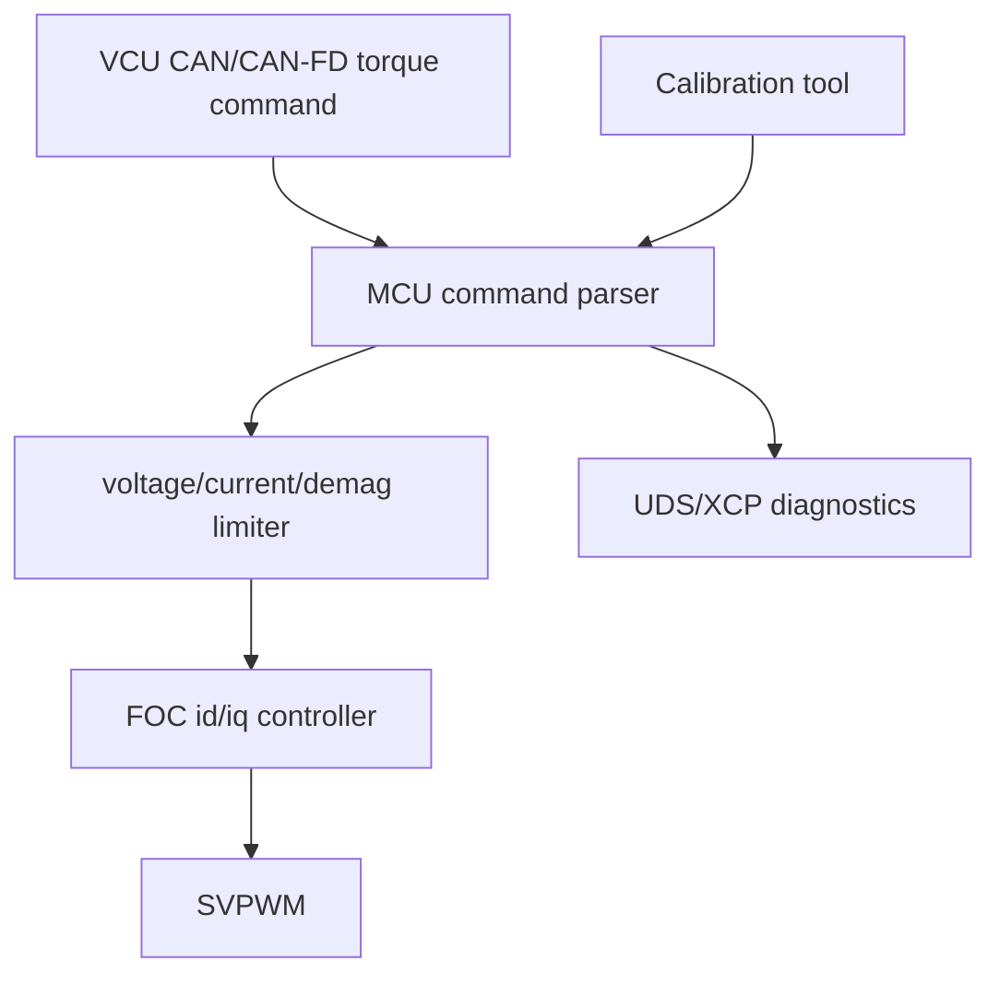
```mermaid
flowchart TD
  VCU[VCU CAN/CAN-FD torque command] --> MCU[MCU command parser]
  MCU --> LIM[voltage/current/demag limiter]
  LIM --> FOC[FOC id/iq controller]
  FOC --> PWM[SVPWM]
  MCU --> DIAG[UDS/XCP diagnostics]
  CAL[Calibration tool] --> MCU
```

## 2. mtpa_fw_mtpv_control

### 驱动设计图

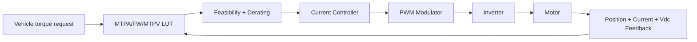
```mermaid
flowchart LR
  VCU[Vehicle torque request] --> LUT[MTPA/FW/MTPV LUT]
  LUT --> LIM[Feasibility + Derating]
  LIM --> FOC[Current Controller]
  FOC --> PWM[PWM Modulator]
  PWM --> INV[Inverter]
  INV --> M[Motor]
  M --> FB[Position + Current + Vdc Feedback]
  FB --> LUT
```

### 上电时序图

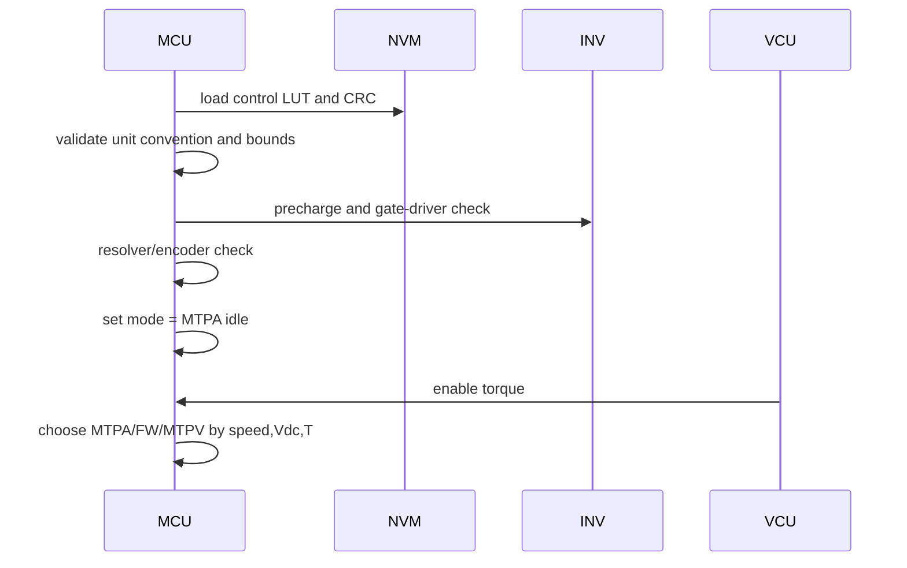
```mermaid
sequenceDiagram
  participant MCU
  participant NVM
  participant INV
  participant VCU
  MCU->>NVM: load control LUT and CRC
  MCU->>MCU: validate unit convention and bounds
  MCU->>INV: precharge and gate-driver check
  MCU->>MCU: resolver/encoder check
  MCU->>MCU: set mode = MTPA idle
  VCU->>MCU: enable torque
  MCU->>MCU: choose MTPA/FW/MTPV by speed,Vdc,T
```

### 协议链路图

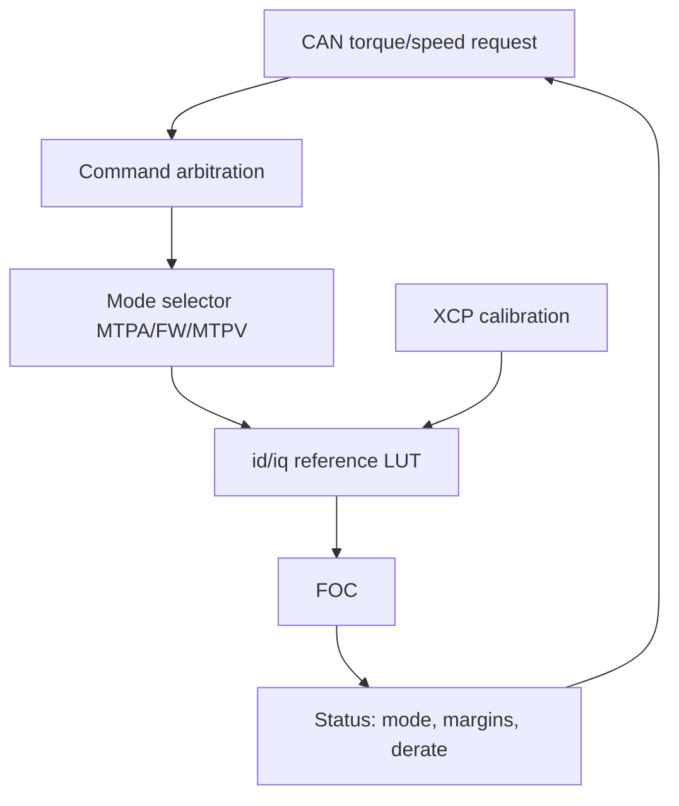
```mermaid
flowchart TD
  CAN[CAN torque/speed request] --> CMD[Command arbitration]
  CMD --> MODE[Mode selector MTPA/FW/MTPV]
  MODE --> LUT[id/iq reference LUT]
  LUT --> CTRL[FOC]
  CTRL --> STAT[Status: mode, margins, derate]
  STAT --> CAN
  XCP[XCP calibration] --> LUT
```

## 3. svpwm_overmodulation_voltage_utilization

### 驱动设计图

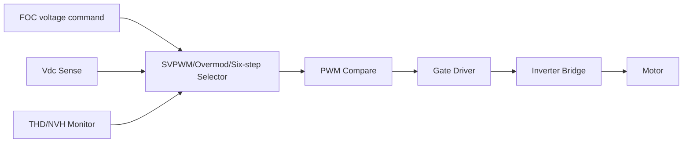
```mermaid
flowchart LR
  FOC[FOC voltage command] --> MOD[SVPWM/Overmod/Six-step Selector]
  MOD --> PWM[PWM Compare]
  PWM --> GD[Gate Driver]
  GD --> INV[Inverter Bridge]
  INV --> M[Motor]
  VDC[Vdc Sense] --> MOD
  THD[THD/NVH Monitor] --> MOD
```

### 上电时序图

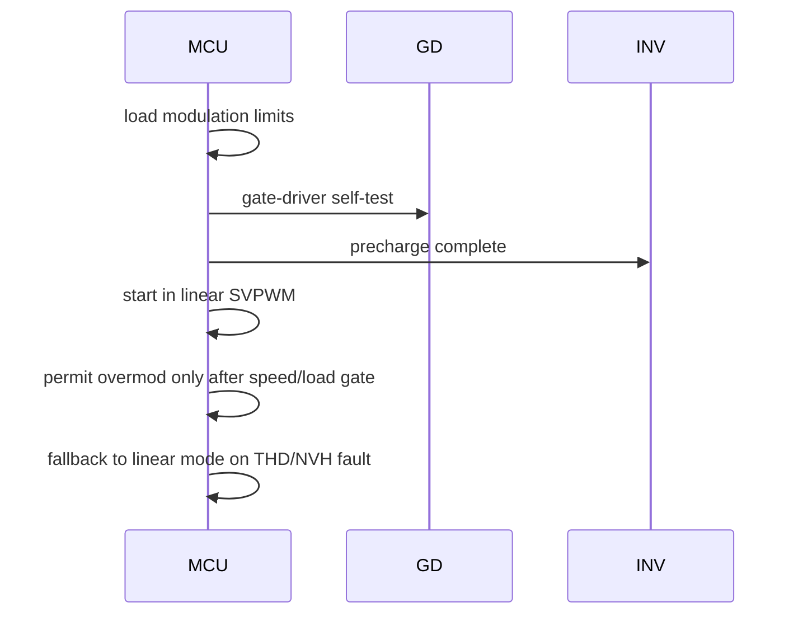
```mermaid
sequenceDiagram
  participant MCU
  participant GD
  participant INV
  MCU->>MCU: load modulation limits
  MCU->>GD: gate-driver self-test
  MCU->>INV: precharge complete
  MCU->>MCU: start in linear SVPWM
  MCU->>MCU: permit overmod only after speed/load gate
  MCU->>MCU: fallback to linear mode on THD/NVH fault
```

### 协议链路图

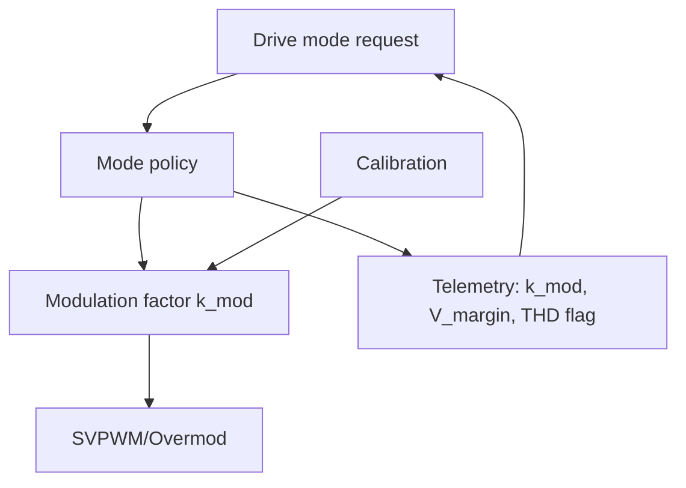
```mermaid
flowchart TD
  VCU[Drive mode request] --> MCU[Mode policy]
  MCU --> MOD[Modulation factor k_mod]
  MOD --> PWM[SVPWM/Overmod]
  MCU --> TEL[Telemetry: k_mod, V_margin, THD flag]
  TEL --> VCU
  CAL[Calibration] --> MOD
```

## 4. nonlinear_flux_lut

### 驱动设计图

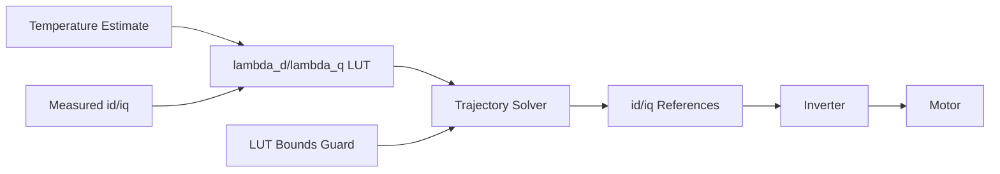
```mermaid
flowchart LR
  LUT[lambda_d/lambda_q LUT] --> TRAJ[Trajectory Solver]
  TRAJ --> FOC[id/iq References]
  FOC --> INV[Inverter]
  INV --> M[Motor]
  T[Temperature Estimate] --> LUT
  IDIQ[Measured id/iq] --> LUT
  BOUNDS[LUT Bounds Guard] --> TRAJ
```

### 上电时序图

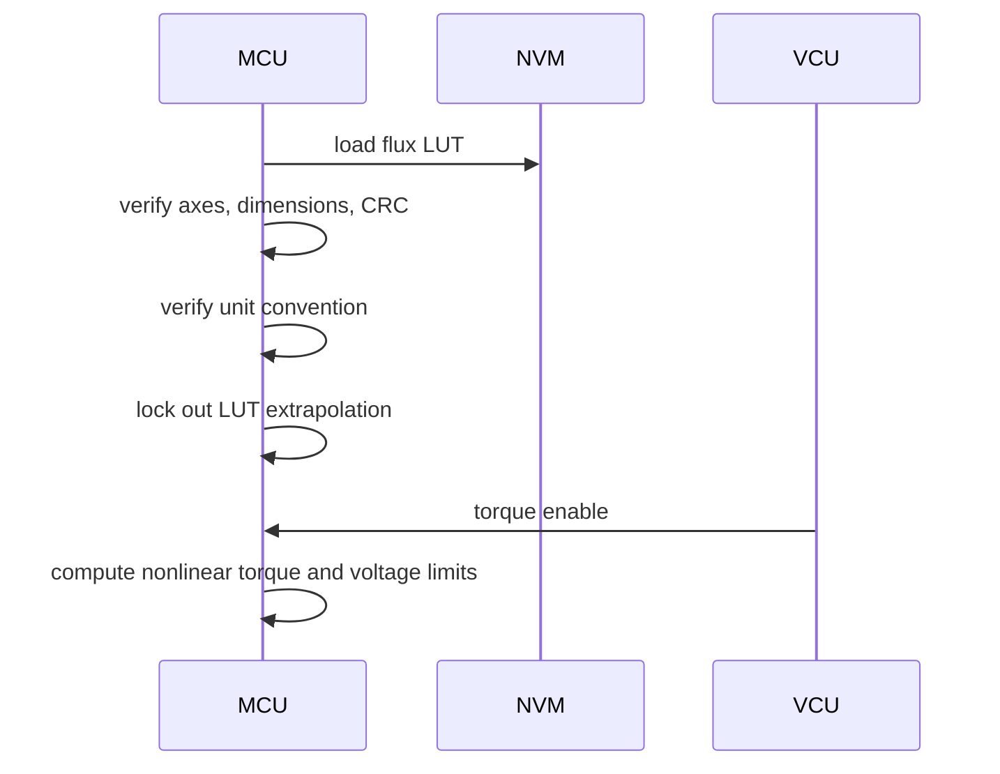
```mermaid
sequenceDiagram
  participant MCU
  participant NVM
  participant VCU
  MCU->>NVM: load flux LUT
  MCU->>MCU: verify axes, dimensions, CRC
  MCU->>MCU: verify unit convention
  MCU->>MCU: lock out LUT extrapolation
  VCU->>MCU: torque enable
  MCU->>MCU: compute nonlinear torque and voltage limits
```

### 协议链路图

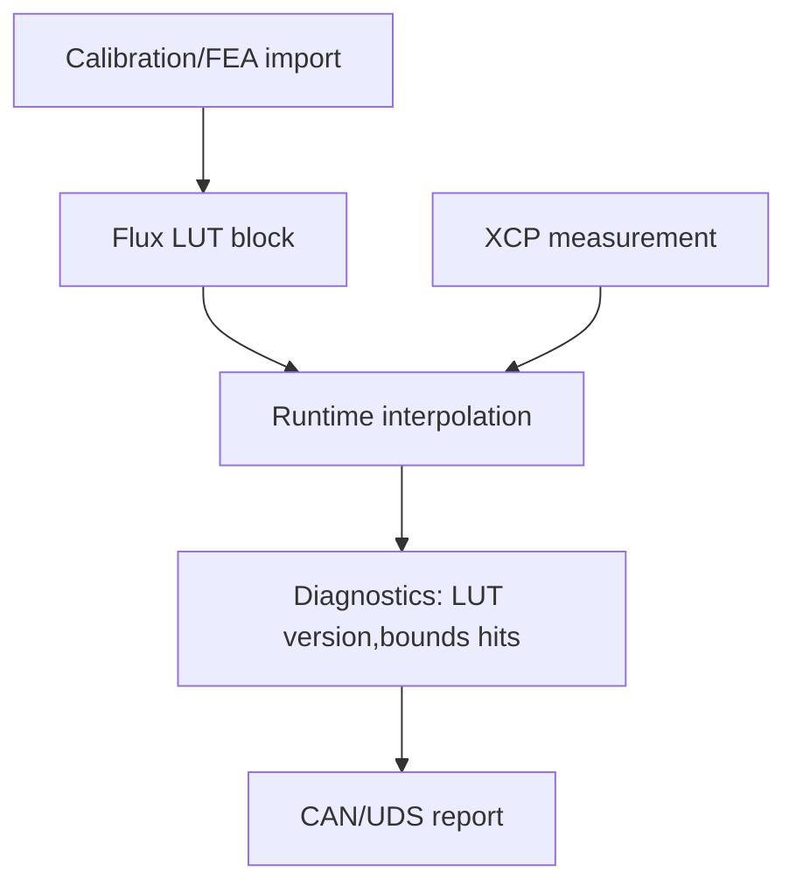
```mermaid
flowchart TD
  CAL[Calibration/FEA import] --> LUT[Flux LUT block]
  LUT --> MCU[Runtime interpolation]
  MCU --> DIAG[Diagnostics: LUT version,bounds hits]
  DIAG --> CAN[CAN/UDS report]
  XCP[XCP measurement] --> MCU
```

## 5. magnetic_saturation_codesign

### 驱动设计图

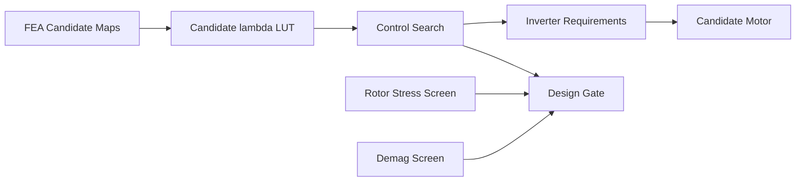
```mermaid
flowchart LR
  FEA[FEA Candidate Maps] --> LUT[Candidate lambda LUT]
  LUT --> CTRL[Control Search]
  CTRL --> INV[Inverter Requirements]
  INV --> M[Candidate Motor]
  STRESS[Rotor Stress Screen] --> GATE[Design Gate]
  DEMAG[Demag Screen] --> GATE
  CTRL --> GATE
```

### 上电时序图

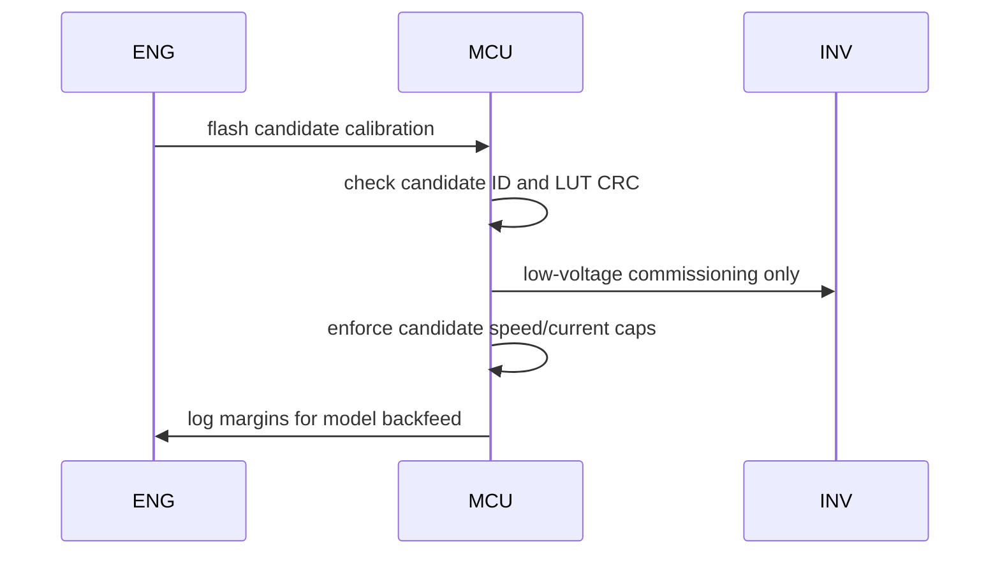
```mermaid
sequenceDiagram
  participant ENG
  participant MCU
  participant INV
  ENG->>MCU: flash candidate calibration
  MCU->>MCU: check candidate ID and LUT CRC
  MCU->>INV: low-voltage commissioning only
  MCU->>MCU: enforce candidate speed/current caps
  MCU->>ENG: log margins for model backfeed
```

### 协议链路图

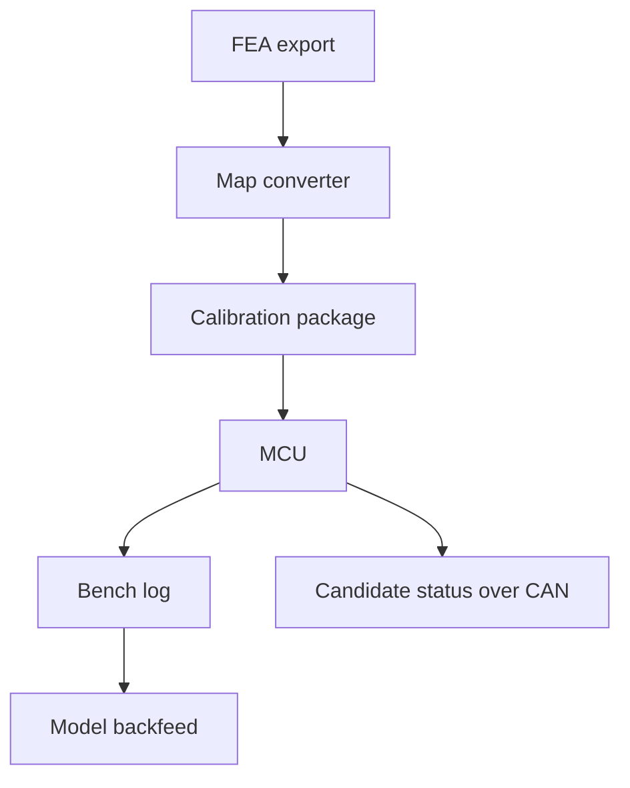
```mermaid
flowchart TD
  FEA[FEA export] --> DATA[Map converter]
  DATA --> CAL[Calibration package]
  CAL --> MCU[MCU]
  MCU --> LOG[Bench log]
  LOG --> FEA2[Model backfeed]
  MCU --> DIAG[Candidate status over CAN]
```

## 6. pmasynrm_high_saliency_low_pm

### 驱动设计图

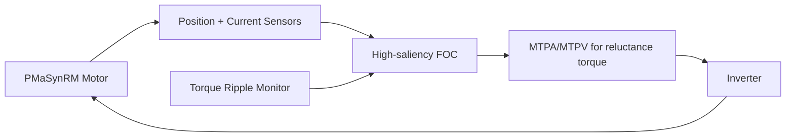
```mermaid
flowchart LR
  M[PMaSynRM Motor] --> SENS[Position + Current Sensors]
  SENS --> MCU[High-saliency FOC]
  MCU --> LUT[MTPA/MTPV for reluctance torque]
  LUT --> INV[Inverter]
  INV --> M
  NVH[Torque Ripple Monitor] --> MCU
```

### 上电时序图

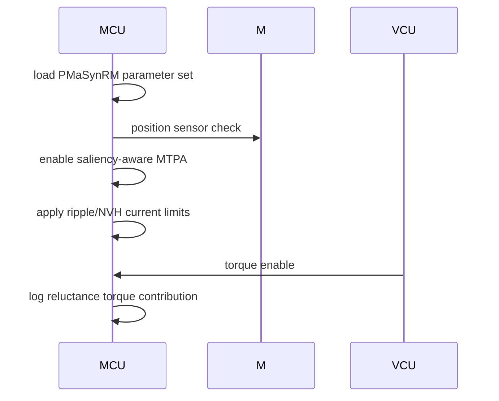
```mermaid
sequenceDiagram
  participant MCU
  participant M
  participant VCU
  MCU->>MCU: load PMaSynRM parameter set
  MCU->>M: position sensor check
  MCU->>MCU: enable saliency-aware MTPA
  MCU->>MCU: apply ripple/NVH current limits
  VCU->>MCU: torque enable
  MCU->>MCU: log reluctance torque contribution
```

### 协议链路图

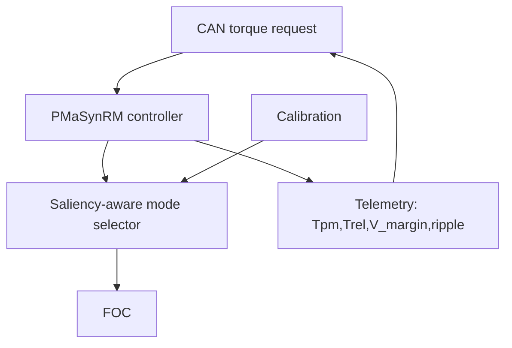
```mermaid
flowchart TD
  VCU[CAN torque request] --> MCU[PMaSynRM controller]
  MCU --> MODE[Saliency-aware mode selector]
  MODE --> FOC[FOC]
  MCU --> TEL[Telemetry: Tpm,Trel,V_margin,ripple]
  TEL --> VCU
  CAL[Calibration] --> MODE
```

## 7. variable_magnetization_memory_motor

### 驱动设计图

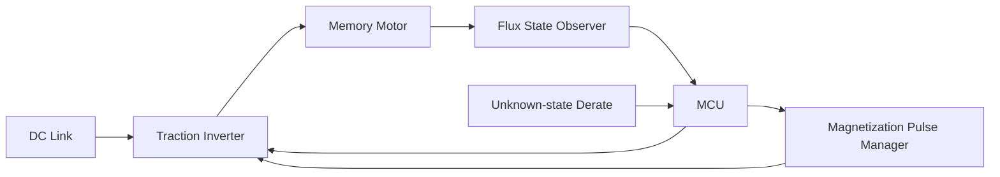
```mermaid
flowchart LR
  DC[DC Link] --> INV[Traction Inverter]
  INV --> M[Memory Motor]
  MCU[MCU] --> INV
  MCU --> PULSE[Magnetization Pulse Manager]
  PULSE --> INV
  OBS[Flux State Observer] --> MCU
  M --> OBS
  SAFE[Unknown-state Derate] --> MCU
```

### 上电时序图

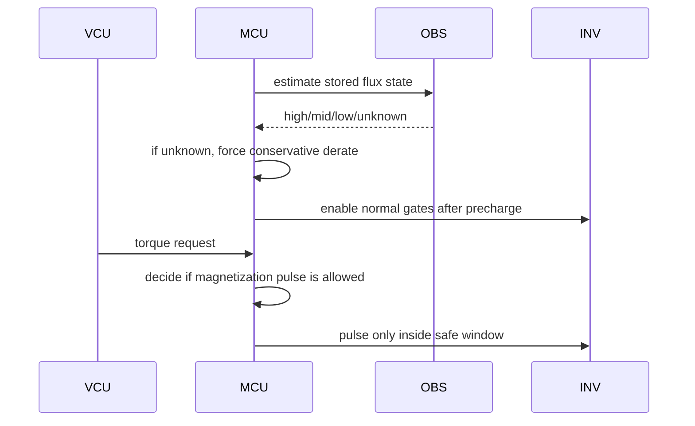
```mermaid
sequenceDiagram
  participant VCU
  participant MCU
  participant OBS
  participant INV
  MCU->>OBS: estimate stored flux state
  OBS-->>MCU: high/mid/low/unknown
  MCU->>MCU: if unknown, force conservative derate
  MCU->>INV: enable normal gates after precharge
  VCU->>MCU: torque request
  MCU->>MCU: decide if magnetization pulse is allowed
  MCU->>INV: pulse only inside safe window
```

### 协议链路图

```mermaid
flowchart TD
  VCU[VCU request: torque + flux mode permission] --> MCU[State machine]
  MCU --> OBS[Flux observer]
  MCU --> PULSE[Pulse command]
  PULSE --> INV[Inverter pulse vector]
  MCU --> DIAG[State, confidence, pulse energy, derate]
  DIAG --> VCU
```

## 8. hybrid_excitation

### 驱动设计图

```mermaid
flowchart LR
  BAT[Battery/DC Link] --> INV[Main Traction Inverter]
  INV --> M[Hybrid-Excited Motor]
  AUX[Field Excitation Converter] --> FW[Field Winding]
  FW --> M
  MCU[MCU id/iq/if Optimizer] --> INV
  MCU --> AUX
  TEMP[Main + Field Temp] --> MCU
```

### 上电时序图

```mermaid
sequenceDiagram
  participant MCU
  participant AUX
  participant INV
  participant VCU
  MCU->>AUX: field converter self-test
  MCU->>INV: main inverter precharge
  MCU->>MCU: set if = safe default
  MCU->>AUX: enable field current loop
  MCU->>INV: enable traction gates
  VCU->>MCU: torque enable
  MCU->>MCU: optimize id/iq/if under thermal limits
```

### 协议链路图

```mermaid
flowchart TD
  VCU[CAN torque request] --> MCU[3-variable optimizer]
  MCU --> MAIN[Main FOC id/iq]
  MCU --> FIELD[Field current if]
  FIELD --> AUX[Excitation converter]
  MCU --> TEL[if, Pfield, temp, loss-of-field fault]
  TEL --> VCU
```

## 9. winding_reconfiguration

### 驱动设计图

```mermaid
flowchart LR
  DC[DC Link] --> INV[Traction Inverter]
  INV --> SW[High-current Winding Switch Matrix]
  SW --> M[Reconfigurable Winding Motor]
  MCU[MCU] --> INV
  MCU --> SW
  SENS[Current/Vdc/Position] --> MCU
  SAFE[Default Safe Winding State] --> SW
```

### 上电时序图

```mermaid
sequenceDiagram
  participant MCU
  participant SW
  participant INV
  participant VCU
  MCU->>SW: verify default safe configuration
  MCU->>INV: precharge DC link
  MCU->>SW: continuity/isolation check
  MCU->>INV: enable gates
  VCU->>MCU: torque enable
  MCU->>MCU: permit reconfiguration only at safe current/speed
  MCU->>SW: switch winding state with torque ramp
```

### 协议链路图

```mermaid
flowchart TD
  VCU[CAN mode/torque request] --> MCU[Reconfiguration supervisor]
  MCU --> CHECK[Speed/current/torque continuity check]
  CHECK --> SW[Switch matrix command]
  MCU --> FOC[Configuration-specific FOC]
  MCU --> DIAG[Config state, switch fault, isolation status]
  DIAG --> VCU
```

## 10. multiphase_phase_group_control

### 驱动设计图

```mermaid
flowchart LR
  DC[DC Link] --> INV1[Phase Group A Inverter]
  DC --> INV2[Phase Group B Inverter]
  INV1 --> M[Multiphase Motor]
  INV2 --> M
  MCU[Multiphase Controller] --> INV1
  MCU --> INV2
  FAULT[Phase Fault Detector] --> MCU
```

### 上电时序图

```mermaid
sequenceDiagram
  participant MCU
  participant INV1
  participant INV2
  participant VCU
  MCU->>INV1: group A self-test
  MCU->>INV2: group B self-test
  MCU->>MCU: phase mapping and sensor check
  MCU->>MCU: select normal or fault-tolerant mode
  VCU->>MCU: torque enable
  MCU->>MCU: distribute current by thermal/fault state
```

### 协议链路图

```mermaid
flowchart TD
  VCU[CAN torque request] --> MCU[Multiphase torque allocator]
  MCU --> A[Group A current refs]
  MCU --> B[Group B current refs]
  FAULT[Phase fault status] --> MCU
  MCU --> TEL[Available torque, failed phase, derate]
  TEL --> VCU
```

## 11. thermal_demag_safety_protection

### 驱动设计图

```mermaid
flowchart LR
  TEMP[Winding + Magnet Temp Estimate] --> SAFE[Safety Supervisor]
  VDC[Vdc + Current Sense] --> SAFE
  POS[Position Quality] --> SAFE
  SAFE --> LIMIT[id_min(T), Imax(T), torque derate]
  LIMIT --> FOC[FOC]
  FOC --> INV[Inverter]
  INV --> M[Motor]
```

### 上电时序图

```mermaid
sequenceDiagram
  participant MCU
  participant SAFE
  participant INV
  participant VCU
  MCU->>SAFE: initialize safety limits
  SAFE->>SAFE: validate temp, Vdc, current sensors
  MCU->>INV: precharge only if sensors valid
  SAFE->>MCU: publish id_min(T), Imax(T)
  MCU->>INV: enable gates
  VCU->>MCU: torque request
  SAFE->>MCU: override with derate if needed
```

### 协议链路图

```mermaid
flowchart TD
  Sensors[Temp/Vdc/current/position sensors] --> SAFE[Safety supervisor]
  SAFE --> FOC[Torque and current limits]
  SAFE --> DTC[Diagnostic trouble codes]
  DTC --> CAN[CAN/UDS]
  CAL[Safety calibration] --> SAFE
  SAFE --> LOG[Fault snapshot log]
```

## 12. weighted_efficiency_pareto_selection

### 驱动设计图

```mermaid
flowchart LR
  DATA[Experiment JSON/CSV] --> SCORE[Weighted Scorecard]
  SCORE --> DECIDE[Pareto Route Selection]
  DECIDE --> CAL[Calibration Package]
  CAL --> MCU[Drive Controller]
  RISK[Risk + Maturity Rating] --> SCORE
  COST[Hardware Complexity] --> SCORE
```

### 上电时序图

```mermaid
sequenceDiagram
  participant ENG
  participant MCU
  participant VCU
  ENG->>MCU: deploy selected route calibration
  MCU->>MCU: verify route ID, scorecard version, CRC
  MCU->>MCU: load safety limits before torque enable
  VCU->>MCU: torque enable
  MCU->>VCU: report active route and derate capability
```

### 协议链路图

```mermaid
flowchart TD
  SIM[Simulation outputs] --> SCORE[Scorecard generator]
  BENCH[Bench logs] --> SCORE
  SCORE --> REC[Route recommendation]
  REC --> VCU[Vehicle integration decision]
  MCU[Runtime controller] --> LOG[Field data]
  LOG --> SCORE
```
